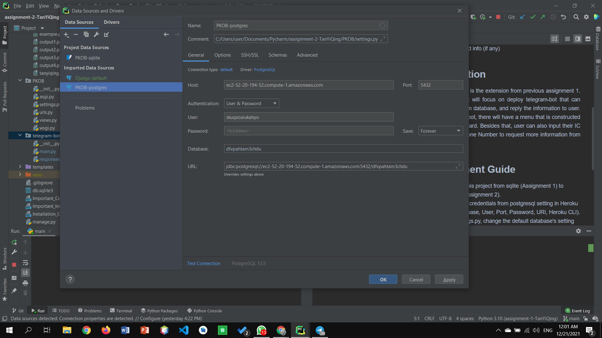
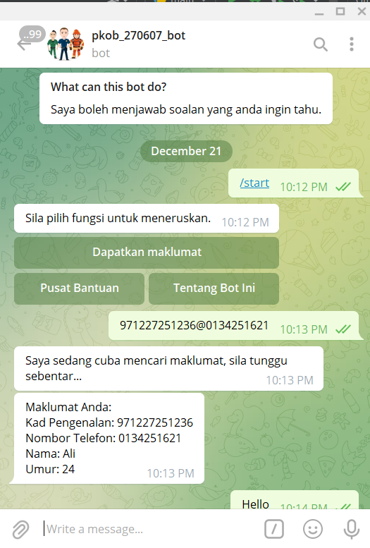
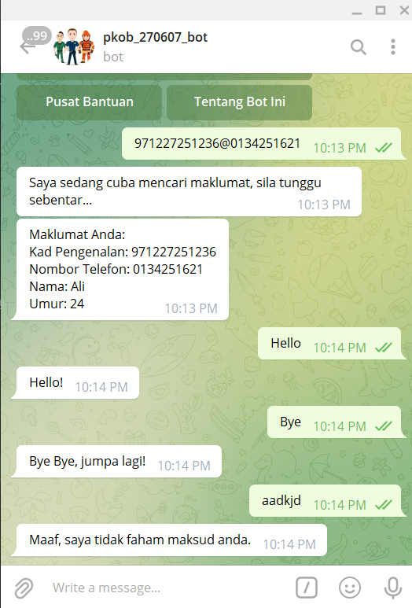

## Requirements for Assignment-2
[Read the instruction](https://github.com/STIW3054-A211/e-sulam/blob/main/Assignment-2.md)

## Your Info:
1. Matric Number & Name & Photo & Phone Number

|             Name             | Matric No |  Phone Number   |                    Image                   |
| :--------------------------: | :-------: | :-------------: |  :---------------------------------------: |
|         Tan Yi Qing          |  270607   |  +60103373137   |      |
2. Other related info (if any)

## Introduction

This assignment is the extension from previous assignment 1. This assignment will focus on deploy telegram-bot that can retrieve data from database, and reply the information to user. In this telegram bot, there will have a menu that is constructed with inline keyboard. Besides that, user can also input their IC Number and Phone Number to request more information from the database.

## Deployment Guide
1. Transform this project from sqlite (Assignment 1) to Postgres (Assignment 2).
   
    1.1. Get the credentials from postgresql setting in Heroku (Host, Database, User, Port, Password, URI, Heroku CLI).
    1.2.  In settings.py, change the default database's setting with the credentials get just now.
    1.3.  Configure the database with imported postgresql.
         
2. Create a folder (telegram-bot in my case) and put the python code for telegram bot inside.
3. Deploy the code to Heroku.

    3.1. In the folder created to store the python code for telegram bot, create a `__init__.py`.

    3.2. In Procfile, configure the worker to work the telegram-bot. 
    
    3.3. Reset dynos with `heroku ps:scale worker=1`

    3.4. Deploy to heroku.

## Result/Output (Screenshot of the output)

## Youtube Presentation
https://youtu.be/6B6d5zIk4-E
## List of Python packages (including the version) used for this system
|Package               |Version
|--------------------- |-----------
|APScheduler           |3.6.3
|asgiref               |3.4.1
|cachetools            |4.2.2
|certifi               |2021.10.8
|cffi                  |1.15.0
|cryptography          |36.0.1
|decorator             |5.1.0
|dj-database-url       |0.5.0
|Django                |3.2.8
|future                |0.18.2
|gunicorn              |20.1.0
|pip                   |21.1.2
|psycopg2-binary       |2.9.2
|pycparser             |2.21
|python-telegram-bot   |12.7
|pytz                  |2021.3
|pytz-deprecation-shim |0.1.0.post0
|setuptools            |57.0.0
|six                   |1.16.0
|sqlparse              |0.4.2
|tornado               |6.1
|tzdata                |2021.5
|tzlocal               |4.1
|wheel                 |0.36.2

## References (Not less than 10)
Migrating data from SQlite to PostgreSQL | Django. (2021, May 24). [Video]. YouTube. https://www.youtube.com/watch?v=BGEEzjGadYI&feature=youtu.be

Palace, C. (2021, August 16). How to create a Telegram Bot for FREE in Python - PyCharm & Python 3.8 Installation [Video]. YouTube. https://www.youtube.com/watch?v=YNY1OGnhSow&feature=youtu.be

Sammour, I. (2021, September 30). Python Telegram Bot with Custom Keyboard, Buttons, and Images [Video]. YouTube. https://www.youtube.com/watch?v=5qzsKXxElQ4&feature=youtu.be

Elements Marketplace: Heroku Telegram python deploy. (n.d.). Heroku. https://elements.heroku.com/buttons/anshumanfauzdar/telegram-bot-heroku-deploy

Execute PostgreSql query in django. (2019, May 21). Stack Overflow. https://stackoverflow.com/questions/56238978/execute-postgresql-query-in-django

How to use PostgreSQL with Django. (n.d.). EDB. https://www.enterprisedb.com/postgres-tutorials/how-use-postgresql-django

Proper way to build menus with python-telegram-bot. (2018, July 1). Stack Overflow. https://stackoverflow.com/questions/51125356/proper-way-to-build-menus-with-python-telegram-bot

Python Database CRUD Sqlite basic using simple student management system. (n.d.). Gist. https://gist.github.com/techsharif/7868666b6c6de97cda20941cd2f8c6be

Richter, M. (2018, December 5). Create your own Telegram bot with Django on Heroku – Part 10 – Creating a view for your bot’s webhook. Marc Richter’s Personal Site. https://www.marc-richter.info/django-telegram-bot-part-10/

Telegram – a new era of messaging. (n.d.). Telegram. https://telegram.org/

